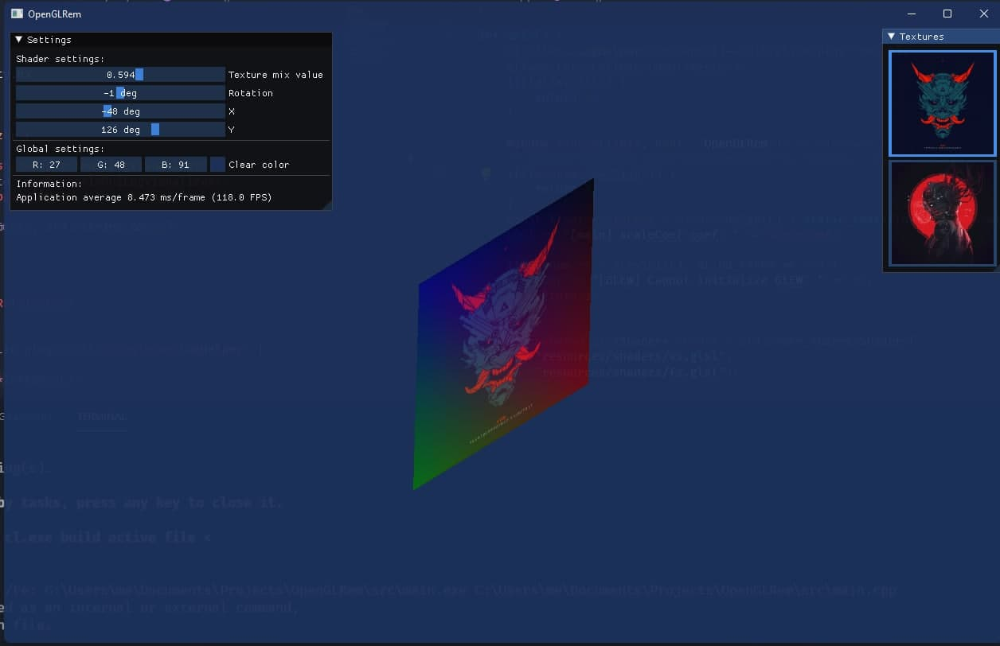
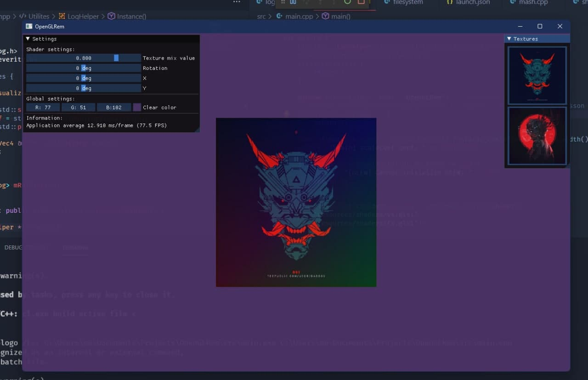

## OpenGLTemplate

Just a template OpenGL project

If you wanna use it you need to `pip install conan` :)

Then all you need is run `cmake .. && cmake --build .`

But you also can use VSCode or whatever you want. I think you know what to do.

The template looks like following screenshot:

 

