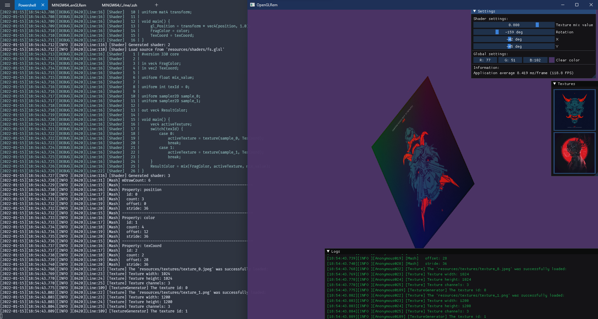
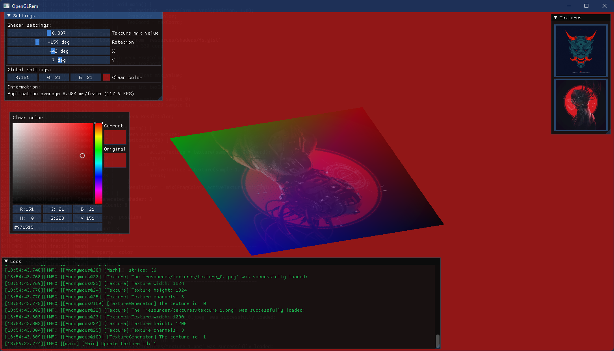

## OpenGLTemplate

<hr align="center" size="2" />

```

Just a template OpenGL project. If you wanna use it you need to
----------------------------------------------------------------
$ pip install conan
----------------------------------------------------------------
Then all you need is run 
----------------------------------------------------------------
$ cmake .. && cmake --build .
----------------------------------------------------------------
But you also can use VSCode or whatever you want.
I think you know what to do.

Oh! You have to run template nearby with resources folder!
 + build/Debug
 +---+ resources
 +---+ OpenGLRem.exe

If you have some trouble with template, so,
use another template <3

The template looks like following screenshot:

```

<hr align="center" size="2" />



<hr align="center" size="2" />
<br>



<hr align="center" size="2" />